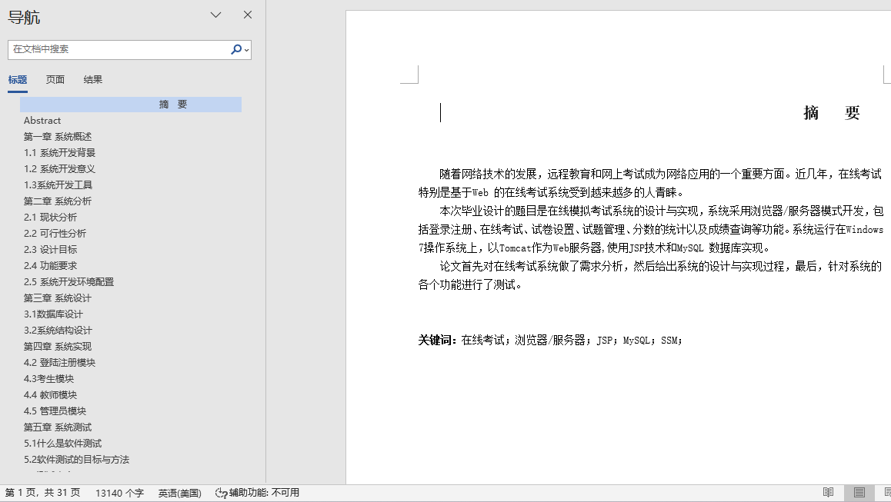
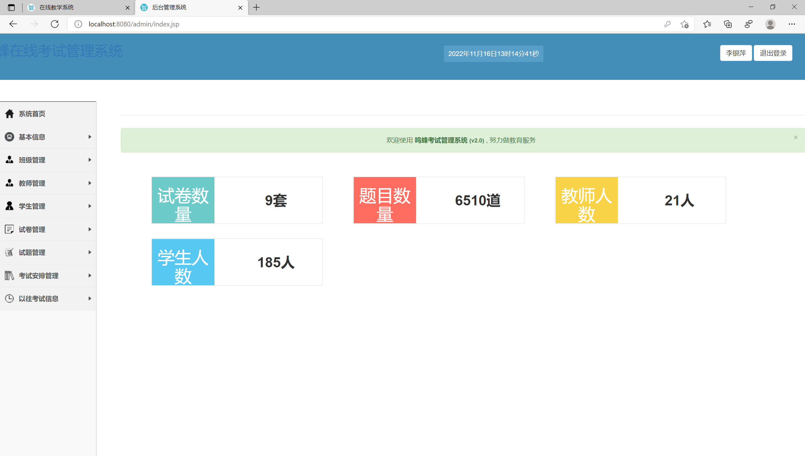
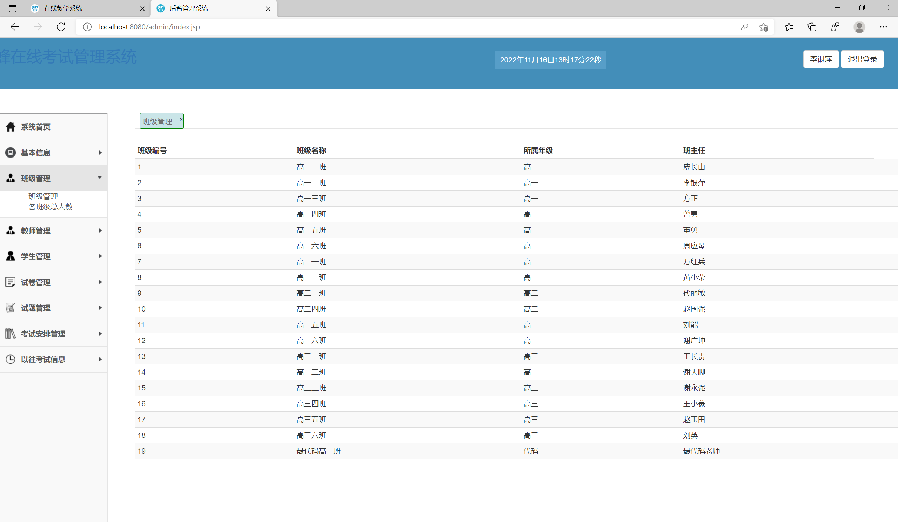
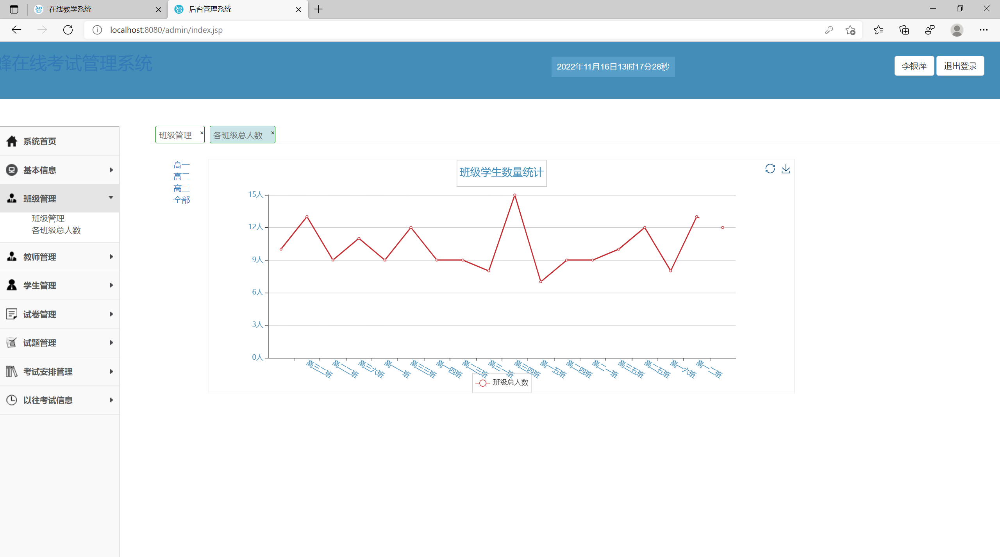
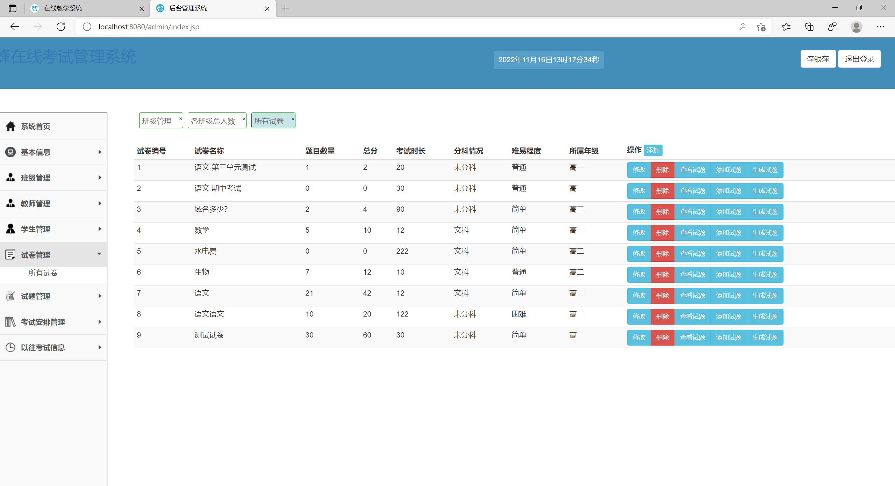
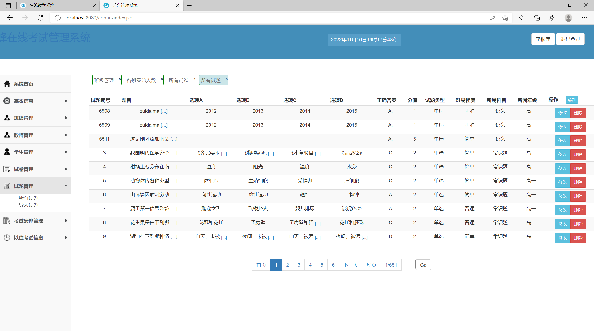
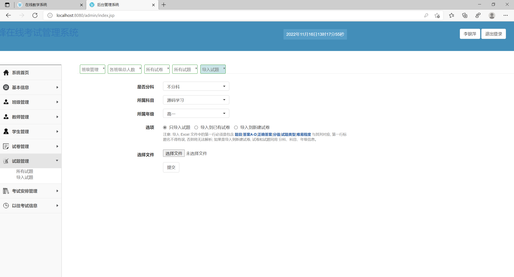
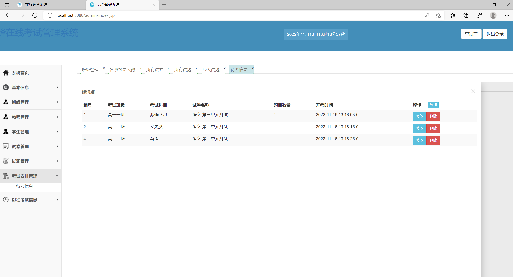
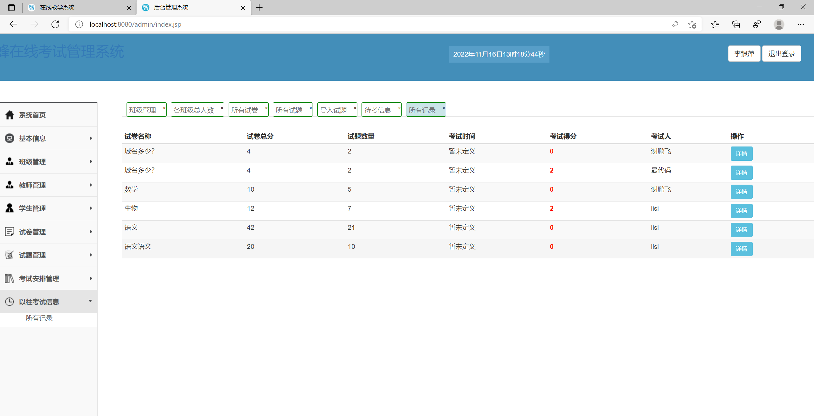
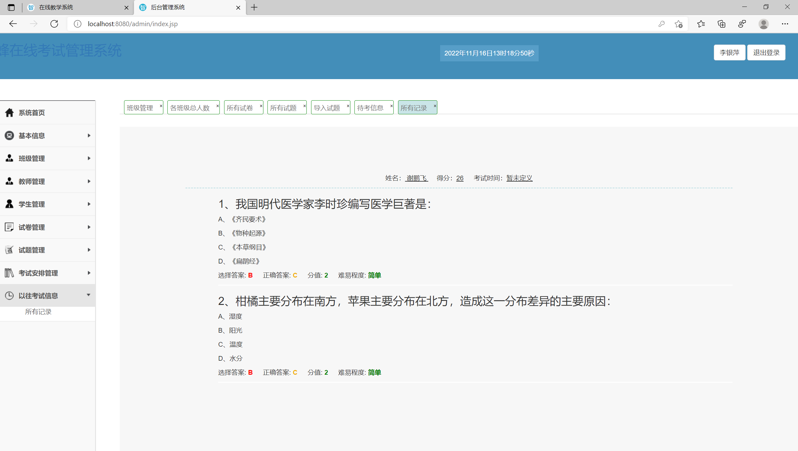

## 基于SSM框架的在线考试系统(程序+报告)

###  获取sql数据库文件: 从戎源码网 (https://armycodes.com/) QQ: 386869957 QQ群: 377586148
###  所有系统地址: (https://github.com/YuLin-Coder/AllProjectCatalog) 
###  所有项目以及源代码本人均调试运行无问题 可支持远程安装部署调试、定制修改、代码讲解

## 项目介绍
基于SSM框架的在线考试系统，有学生、老师、管理员三个角色，系统功能比较完善，支持单选、多选、简答题型，试题可以批量导入，导入时可选择多种方式导入，比如导入到试题库，导入到试卷中或者导入到新建试卷中等，主要功能如下

前台学生登录主要功能包括：
登录、注册、考试中心参加教师分配的考试内容、查看考试历史，回顾考试试卷；

管理员主要功能包括：
首页试卷统计；
基本信息：年级管理、科目管理；
班级管理：班级管理、各班人数折线图统计；
教师管理：教师信息增删改查；
学生管理：学生信息增删改查、学生考试平均成绩柱状图统计；
试卷管理：包括查看试题、添加试题、生成试题；
试题管理：试题列表，导入试题；
考试安排管理：待考信息；
以往考试信息：考试记录；

教师登录后功能菜单与管理员相同，教师只能管理部分考试相关的功能，但会限制当前教师的权限；

## 项目技术
- 编程语言：Java
- 数据库：MySQL
- 前端技术：JSP、JavaScript、Bootstrap、ECharts
- 后端技术：Spring、SpringMVC、MyBatis

## 运行环境
- JDK版本：JDK1.8及以上
- 开发工具：IDEA、Ecplise、Myecplise都可以
- 数据库: MySQL5.7及以上

## 运行截图

